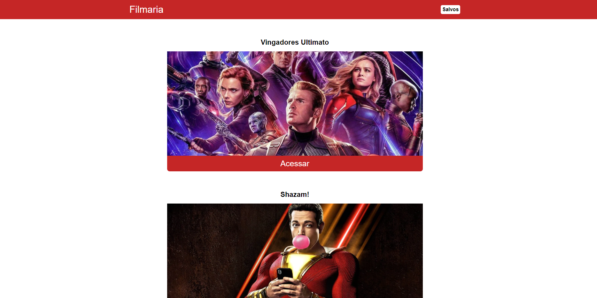
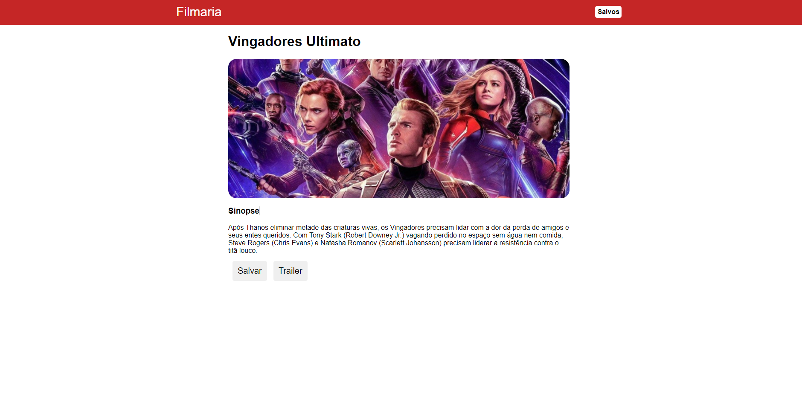
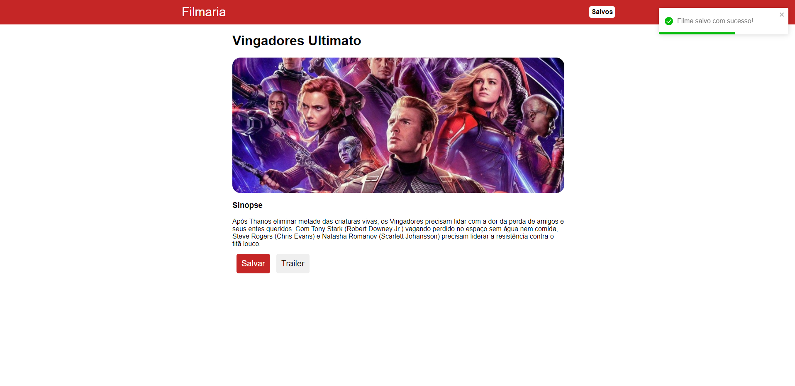
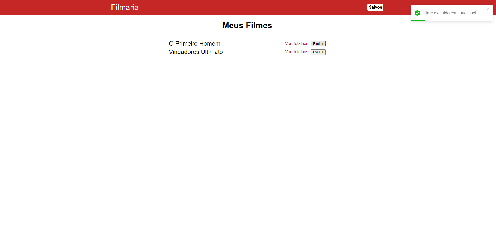

# Projeto Filmaria
 
### Olá! Eu sou Danielle Torres 👋

### Criei este Projeto com o intuito de aprofundar meus conhecimentos em React. Este exercício foi tirado do curso React Js do zero ao avançado na prática.

### Seguem abaixo as imagens do site em React: 

 

    
    
    
    

### Tecnologia utilizada

     

